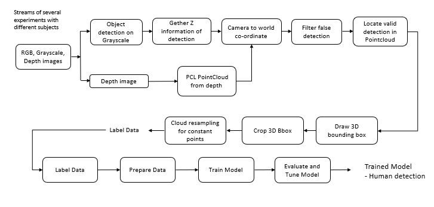

# Master-Thesis
Framework for automatic human and object annotation from the scene in the form of 3D Pointcloud

**Note: There is no coding in this repo since I was not allowed to showcase my code. This will only include the overview of my project with the complete workflow.** 
      
 **After designing the framework, I also prepare labeled dataset of 3D pointcloud (human and other object class) and then trained a 3D classifier after that, deploy it for realtime testing** 
 
- The task was to design a framework that will take the streams of 2D images with their corresponding depth information. The framework will perform automatic human and object annotation in the form of 3D pointcloud from the scene. 

- The framework was designed to work in the industrial environment whereas, industrial environment is different from normal environment. Different lighting condition, presence of robot, different obstacls, reflections, asymmetric backgrounds etc. Therefore it was very important to consider all these limitataion while during the selection of AI algorithms in order to detect human insight the scene.

Framework is based on C++ and the following libraries I used:

- OpenCV 3.4.3 (for 2D image processing)

- PCL 1.8 (for 3D pointcloud processing)

**Framework design**

- This whole process was a part of a giant project in the step of Industry automization. 

- Main target was to detect the human in the scene. Since the end goal is to train the AI algorithm that will detect the human in the scene(3D pointcloud) and localize it so       that it can behave according to its position. If the human is in the range where the robot movement can result in collision then robot will behave according to define rule.     The main aspect is to ensure human safety in human-robot-collaboration.

- The future step after this Master thesis was to make robot able to not just detect human but also to identify human limbs so that it can interect with human in the production   sector. Thats why human localisation was important.

- Most of the open source object detection algorithms has been trained to work in non-industrial environment so their performance decreases in industrial environment. During       testing, Yolo and MASK-RCNN gives false detection in terms of human detection and their false detection were difficult to filter. Another aspect was, their results were in the 
  form of bounding boxes or body lobs.  
  
- Therefore, the depth mapping of those object detection results were giving wrong human localisation while coverting from 2D image detection to 3D information. That's the         reason I use pose estimation algorithm because its results are in the form of skeleton and its 3D mapping were more realistic. Although, pose estimation algorithm is also not   trained to for industrial environment so it also give false detection but to filter those false detection I made some custome filters and used some PCL pointcloud library       filters.

- Here I used [Openpose](https://github.com/CMU-Perceptual-Computing-Lab/openpose) as a pose estimation algorithm which is available in ready to use demo version 

- After that, I took all the steps mentioned in the above worflow figure. **Here the important thing is, there might be other workflow to achieve this goal but this is the one     that I designed after lots of research and trials. I also took all those limitation in consideration. Most importantly, this framework will work annotate automatically means,   we just have to pass 2D camera streams with their corresponding depth information and the farmework will save annotated 3D pointclouds in the form of .PLY format**

- After getting label data, its to prepare it in the form where it will pass to 3D classifier. Since, PointCloud data is based on number of points including lots of information   so it is hard to pass all information one by one to the AI algorithm. So the normal practice is to pass it in the speciall format in the form of HDF5 (.h5) file. 

- Here I use [PointNet++](https://arxiv.org/abs/1706.02413) as a 3D classifier. Its a Point base approach and avalaible in two two architecture **SSG and MSG** 

- **SSG** is good for uniform density pointcloud where as **MSG** is good for also non-uniform density pointcloud. In my case, there was sparsity in pointcloud data so **MSG**     work better instead of **SSG**
